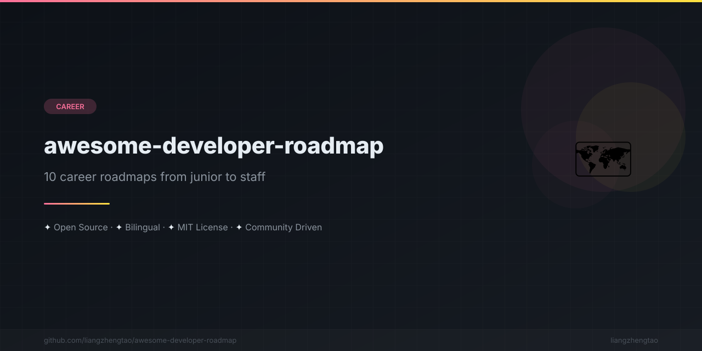

[English](README.md) | [中文](README.zh.md) | [日本語](README.ja.md) | [Français](README.fr.md) | [Español](README.es.md)

# Awesome Developer Roadmap

> 10 hojas de ruta de carrera para desarrolladores, desde junior hasta staff. Habilidades, recursos, proyectos y datos salariales.

---

## Hojas de ruta

| # | Hoja de ruta | Descripción | Dificultad |
|---|---------|-------------|------------|
| 1 | [Desarrollador Frontend](roadmaps/frontend-developer.md) | Rutas React / Vue / Angular | Principiante → Staff |
| 2 | [Desarrollador Backend](roadmaps/backend-developer.md) | Rutas Node / Python / Go / Java | Principiante → Staff |
| 3 | [Desarrollador Fullstack](roadmaps/fullstack-developer.md) | Desarrollo web de extremo a extremo | Principiante → Staff |
| 4 | [Ingeniero DevOps](roadmaps/devops-engineer.md) | CI/CD, Cloud, Kubernetes | Principiante → Staff |
| 5 | [Ingeniero AI/ML](roadmaps/ai-engineer.md) | Machine Learning, LLMs, MLOps | Principiante → Staff |
| 6 | [Desarrollador Móvil](roadmaps/mobile-developer.md) | iOS / Android / Flutter | Principiante → Staff |
| 7 | [Ingeniero de Datos](roadmaps/data-engineer.md) | Pipelines de datos, almacenes, lagos | Principiante → Staff |
| 8 | [Ingeniero de Seguridad](roadmaps/security-engineer.md) | AppSec, CloudSec, DevSecOps | Principiante → Staff |
| 9 | [Arquitecto de Sistemas](roadmaps/system-architect.md) | Patrones de arquitectura, sistemas distribuidos | Senior → Principal |
| 10 | [Tech Lead / EM](roadmaps/tech-lead.md) | Gestión de ingeniería, liderazgo | Senior → VP |

---

## Contenido de cada hoja de ruta

Cada hoja de ruta incluye:

- **Diagrama ASCII de carrera** — Visualización del progreso profesional
- **Lista de habilidades** — Seguimiento de habilidades con casillas de verificación
- **Recursos de aprendizaje** — Libros, cursos y documentación seleccionados
- **Ideas de proyectos** — Proyectos para portafolio en cada etapa
- **Preparación para entrevistas** — Preguntas frecuentes y consejos
- **Expectativas salariales** — Datos de compensación por nivel y región
- **Versión en chino** — Traducción al chino al final de cada archivo

---

## Inicio rápido

1. **Encuentra tu hoja de ruta** — Elige el rol que coincida con tus objetivos profesionales
2. **Evalúa tu nivel** — Identifica en qué etapa te encuentras actualmente
3. **Revisa las habilidades** — Usa las casillas para seguir tu progreso
4. **Construye proyectos** — Completa proyectos de cada etapa para enriquecer tu portafolio
5. **Prepárate para entrevistas** — Revisa los consejos de entrevista antes de postularte

---

## Niveles de carrera

| Nivel | Experiencia | Descripción |
|-------|------------|-------------|
| **Junior** | 0-2 años | Aprendiendo fundamentos, construyendo funcionalidades básicas |
| **Mid** | 2-4 años | Trabajo independiente, contribuyendo a proyectos de equipo |
| **Senior** | 4-7 años | Liderando funcionalidades, mentoría, decisiones técnicas |
| **Staff** | 7-10 años | Impacto inter-equipos, arquitectura, estrategia técnica |
| **Principal** | 10+ años | Impacto organizacional, innovación, liderazgo en la industria |

---

## Resumen salarial (mercado estadounidense, anual)

| Rol | Junior | Mid | Senior | Staff | Principal |
|------|--------|-----|--------|-------|-----------|
| Frontend | $75K | $105K | $145K | $190K | $240K |
| Backend | $80K | $115K | $155K | $205K | $260K |
| Fullstack | $70K | $100K | $140K | $185K | $235K |
| DevOps | $75K | $110K | $150K | $200K | $250K |
| AI/ML | $90K | $130K | $175K | $230K | $290K |
| Móvil | $75K | $110K | $150K | $195K | $245K |
| Ing. Datos | $80K | $120K | $160K | $210K | $265K |
| Seguridad | $75K | $115K | $160K | $215K | $275K |

*Nota: Los salarios varían significativamente según la ubicación, el tamaño de la empresa y la industria. Las empresas FAANG/principales de tecnología suelen pagar un 30-50% por encima de la mediana.*

---

## Contribuir

¡Las contribuciones son bienvenidas! Consulta nuestra [Guía de contribución](CONTRIBUTING.md) para más detalles.

Formas de contribuir:
- Añadir nuevas hojas de ruta
- Actualizar datos salariales
- Mejorar contenido existente
- Corregir errores tipográficos y de contenido
- Añadir recursos de aprendizaje
- Traducir a otros idiomas

---

## Licencia

Este proyecto está bajo la licencia MIT — ver el archivo [LICENSE](LICENSE) para más detalles.

---

## Agradecimientos

Inspirado por [developer-roadmap](https://github.com/kamranahmedse/developer-roadmap) (364k+ stars).

Construido con ❤️ por la comunidad.

---

## Star History

